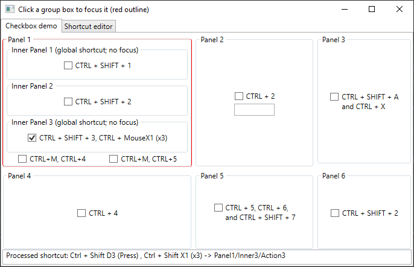
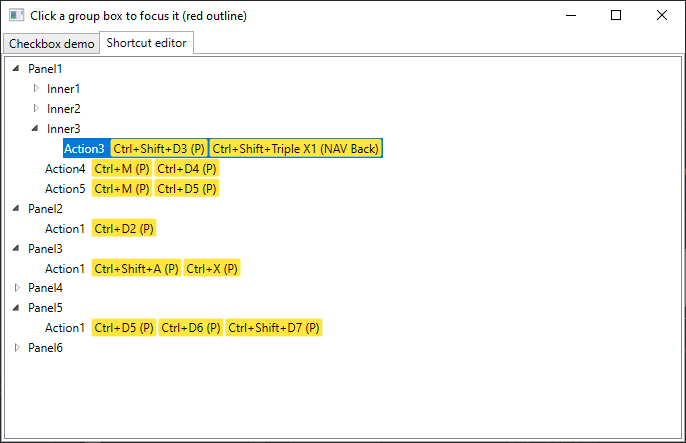

# FocusGroupHotkeys
An app for managing multi-stage key and mouse shortcuts (e.g. the similar behaviour found in Intellij IDEA, Visual Studio, etc)

This can be used to create shotcuts like "CTRL + M, CTRL + X" which require you to press M and then X while holding CTRL (irregardless on key release or modifier key pressed)

I also implemented a similar behaviour to Adobe Premiere Pro's Panel focus (and probably many other programs, but adobe seems like the only one that outlines the panel), where clicking different panels will focus them, changing which key bindings can be activated. A "Panel" is defined with a path, which in this app is an attached property (found in `UIFocusGroup`, as `FocusGroupPathProperty`).

Shortcuts and groups are defined as paths, like a file system; You have folders (shortcut groups) and the files (shortcuts)

# Preview
At the bottom is the status indicator (i was lazy so I just created a static MainWindow reference to access the text block). The shortcuts switch the toggle state of the check boxes (all done through multiple ICommands and bool properties, in MainViewModel)


This is the shortcut editor. Also kinda copied IntelliJ IDEA's layout with the yellow background. You can right click a shortcut to add key/mouse strokes, or remove one of the strokes. I created a small context menu item generation library to help with that (IContextGenerator, ContextElement, etc)


## Input strokes
The whole system works around "Key" and "Mouse" strokes. KeyStrokes have a KeyCode, Modifiers, and IsKeyRelease property, and MouseStrokes have a MouseButton, (keyboard) Modifiers, ClickCount and WheelDelta property. I tried to make it as cross-platform as possible, so Key codes (for keyboard and mouse) are plain integers. In the WPF example, i'm just casting to and from the Key and ModifierKeys enum (except for mouse wheel, WHEEL_UP and WHEEL_DOWN are defined with a custom MouseButton integer. Was also thinking about "mouse flicks" but i have no idea how to begin implementing that)

## Keymap storage
The key map are loaded from an XML file just so that it's easy to add and remove shortcuts. You could also add some functions to create the groups purely in C# code. 

Shortcuts are stored in ShortcutGroups, and the root ShortcutGroup is stored in a ShortcutManager.

In the XML file, you don't directly supply the paths, you instead just provide the Name attribute for each group and shortcut, and the C# will generate the path using the '/' char

## Global/Inheritance
Shortcuts and ShortcutGroups have an "IsGlobal" property, which means that they can be fired even if they aren't in the currently focused panel, or even in the panel's hierarchy (hense, global ;D). 

I actually can't quite remember what the inherit feature does, apart from that instead of doing an equality comparison between the focused path and the current shortcut group path (as in, the one being searched during an input stroke), it instead checks if the focused path begins with the current shortcut group path

## Shortcut activated events
Creating events when shortcuts are activated can be done by inheriting from the ShortcutManager and overriding the OnShortcutActivated function. 
The return type is passed to the key event's Handled flag.

## Shortcut activated command binding
I implemented the extra functionality in the `WPFShortcutManager`. To create a shortcut binding, you can use the `ShortcutActionBinding` or `ShortcutCommandBinding` class which you add to a UIElement's InputBindings (easier than using an attached collection property). These 2 classes contain a `ShortcutAndUsageId` property, used to register the shortcut binding with the `WPFShortcutManager`, and the manager will handle the rest (it will store a callback function into the shortcut binding, which invokes the shortcut action or command based on what you used)

Due to the limitation of input bindings, you need to supply the full path in the shortcut binding, because the reference to the input bindings's dependency property parent is internal, meaning the parent group cannot be inferred.

Then there's the "UsageID" part of the binding, which is used as a 2nd filter layer to determind which action(s) finally get called. This is because the shortcut input binding classes register their callbacks with the `WPFShortcutManager` meaning it spans the entire application. Because of this, there could be a case where you have the same shortcut ID used in multiple input bindings, which would cause them to "intersect".

So instead, you would set a specific usage id in the `ShortcutAndUsageId` property (e.g "My/Shortcut/Path:Usage1" and "My/Shortcut/Path:Usage2"). And then, similar to the `FocusGroupPath`, you would set `UsageID` on a specific control (most likely the one which houses the shortcut input bindings, or at least, the one which has a focus group path set on it), e.g. "Usage1" and "Usage2". `UsageID` is inherited so you can create a complex setup of which shortcut actually gets called

### ShortcutCommandBinding should only be used for "global" ICommands
The shortcut command binding, like the action one, registers a callback with the `WPFShortcutManager` which then gets invoked and the command is executed. However, that callback is only unregistered when `ShortcutAndUsageId` is set to null, which doesn't happen when the control that owns the binding is unloaded/removed from the visual tree, meaning you will effectively cause a memory leak if you were to put a `ShortcutCommandBinding` on for example every ListBoxItem of a ListBox in which items can be added/removed dynamically.

The easiest way around this, is to just use `AnAction`, and register a custom action and then use the `ShortcutActionBinding` to invoke that action. And then you can look for a target in the action event's data context (`IHasDataContext`)

## Examples
Like what i was talking about above with removing dynamically added items, here is an example from an App i made called SharpPadV2 (v2 of an older version):
```
static TextEditorViewMode() {
    ActionManager.Instance.Register("actions.tabs.CloseTabAction", new CloseTabAction());
}

private class CloseTabAction : AnAction {
    public CloseTabAction() : base(() => "Close Tab", () => "Closes the tab you click with the middle mouse") { 
    }

    public override async Task<bool> Execute(AnActionEventArgs e) {
        if (e.DataContext.TryGetContext(out TextEditorViewModel editor)) {
            // each text editor contains a reference to the "container", which is what contains a
            // collection of all editors along with the active editor. CloseEditor shows a dialog if there are
            // unsaved changes, etc, and then it removes it from the editor collection
            await editor.Container.CloseEditor(editor);
            return true;
        }

        return false;
    }
}
```

And then in your shortcut XML file:
```
<Group Name="Application">
    <Group Name="Views">
        <Shortcut Name="CloseViewShortcut" ActionId="actions.views.CloseViewAction" IsGlobal="true">
            <Keystroke Key="Escape"/>
        </Shortcut>
    </Group>
    <Group Name="EditorTabDeck">
        <Shortcut Name="CloseTabShortcut" ActionId="actions.tabs.CloseTabAction">
            <Mousestroke Button="Middle"/>
        </Shortcut>
    </Group>
</Group>
```

As long as you make sure to load the XML file and the view model registers that action, then it should work without doing anything else. The IHaveDataContext object, which is passed to the `AnActionEventArgs`, will contain the original source object, the data context of the original source object, and the root event sender (normally a window)

### Managers and processors
By default, the `ShortcutProcessor` does nothing when shortcuts are activated, so you would need to extend it and override the `OnShortcutActivated` and/or `OnSecondShortcutUsageCompleted` function to do something. The WPF project does in and invokes actions and the shortcut command bindings

